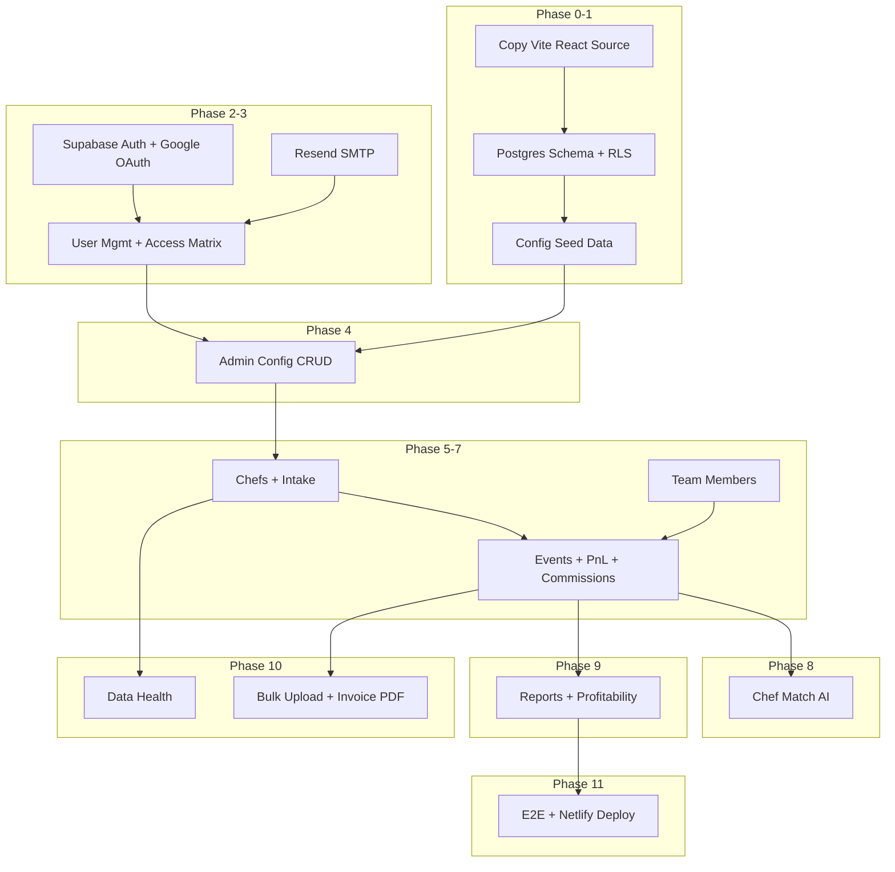

# Gradito Chef Intelligence — Phase-Wise Architectural Plan

Migration from [gradito-chef-flow](../gradito-chef-flow) (Vite + Base44) into Gradito-Intelligence.  
**Frontend stack unchanged. Backend replaced with Supabase. Frontend deployed to Netlify.**

---

## 1. Architecture Overview

```
┌─────────────────────────────────────────────────────────────┐
│  NETLIFY (Frontend)                                         │
│  Vite 6 + React 18 + React Router 6 + TanStack Query      │
│  Tailwind + shadcn/ui — design copied from source          │
└──────────────────────────┬──────────────────────────────────┘
                           │ @supabase/supabase-js
┌──────────────────────────▼──────────────────────────────────┐
│  SUPABASE (Backend) — enftlfmjakfcgaapzesx.supabase.co      │
│  ├── PostgreSQL + RLS                                       │
│  ├── Auth (email + Google OAuth)                            │
│  ├── Storage (chef photos)                                  │
│  └── Edge Functions (LLM, email, invites)                   │
└─────────────────────────────────────────────────────────────┘
```

### Stack Decisions

| Layer | Stack | Action |
|-------|-------|--------|
| **Frontend** | Vite 6 + React 18 + React Router 6 + TanStack Query + Tailwind + shadcn/ui | Keep — copy & reuse from gradito-chef-flow |
| **Design** | Navy/gold/ivory tokens, Playfair + Inter, 52 shadcn components | Copy as-is; modify only where Base44 calls are replaced |
| **Backend** | Supabase PostgreSQL + RLS + Edge Functions | Replace Base44 |
| **Email** | Resend SMTP via Supabase Edge Functions | New |
| **Deploy** | Netlify (SPA) + Supabase (DB, auth, functions) | Frontend → Netlify; backend → Supabase |

### What Changes vs What Stays

| Changes | Stays the Same |
|---------|----------------|
| `base44.entities.*` → Supabase repositories | React Router routes (13 pages) |
| `base44.auth.*` → `supabase.auth.*` | Vite build pipeline |
| `base44.integrations.*` → Edge Functions | Component hierarchy & UI |
| Hardcoded picklists → DB config tables | Tailwind/shadcn design system |
| Add admin `/settings` CRUD (new feature) | Business logic (`pnlUtils`, `commissionUtils`) |

---

## 2. Project Structure (SOLID)

```
Gradito-Intelligence/
├── src/
│   ├── api/
│   │   └── supabaseClient.js          # replaces base44Client.js
│   ├── domain/                        # Pure business logic (no Supabase imports)
│   │   ├── pnl/                       # computePnL, calcExperienceFee
│   │   ├── commission/                # computeCommission
│   │   └── matching/                  # computeMatchScore
│   ├── infrastructure/
│   │   └── repositories/              # Data access only
│   │       ├── ChefRepository.js
│   │       ├── EventRepository.js
│   │       ├── ConfigRepository.js
│   │       └── ...
│   ├── hooks/
│   │   └── useAppData.js              # React Query hooks → repositories
│   ├── lib/                           # AuthContext, utils (adapt auth only)
│   ├── pages/                         # 13 routes — rewire data calls
│   ├── components/                    # Reuse all UI as-is
│   ├── App.jsx                        # React Router — enable ProtectedRoute
│   └── main.jsx
├── supabase/
│   ├── migrations/                    # Postgres schema + RLS
│   ├── functions/
│   │   ├── chef-match/                # LLM criteria + reasons
│   │   ├── parse-invoice-pdf/         # Invoice PDF extraction
│   │   ├── send-email/                # Resend SMTP
│   │   └── invite-user/               # User invitation
│   └── seed.sql
├── netlify.toml                       # SPA deploy config
├── vite.config.js                     # Remove @base44/vite-plugin
├── tailwind.config.js                 # Copy as-is
└── components.json                    # Copy as-is
```

### SOLID Principles

| Principle | Application |
|-----------|-------------|
| **S**ingle Responsibility | Repositories = DB queries; domain = pure math; pages = UI |
| **O**pen/Closed | Config picklists from DB; engines extensible without UI changes |
| **L**iskov | Repository functions return same shapes pages already expect |
| **I**nterface Segregation | Separate hooks: `useChefs`, `useEvents`, `useConfig` |
| **D**ependency Inversion | Pages → hooks → repositories; never `supabase.from()` in components |

---

## 3. Dependency Graph



**Start:** Phase 0 — copy source, strip Base44, wire Supabase client.

---

## 4. Phase-by-Phase Plan

### Phase 0 — Copy Source + Supabase Wiring

| | |
|---|---|
| **Depends on** | Nothing |
| **Blocks** | All phases |

**Build:**
1. Copy gradito-chef-flow into Gradito-Intelligence (exclude `.git`, `node_modules`)
2. Remove Base44: uninstall `@base44/sdk`, `@base44/vite-plugin`; remove plugin from `vite.config.js`
3. Install `@supabase/supabase-js`
4. Create `src/api/supabaseClient.js` (`VITE_SUPABASE_URL`, `VITE_SUPABASE_ANON_KEY`)
5. Create `src/infrastructure/repositories/` (empty stubs)
6. Add `supabase/config.toml` linked to `enftlfmjakfcgaapzesx.supabase.co`
7. Add `netlify.toml` (SPA redirect)
8. Verify app boots with existing UI

**Test gate:**
- [ ] `npm run dev` starts without Base44 errors
- [ ] All routes render (empty/error data states OK)
- [ ] Sidebar, design tokens, fonts match source
- [ ] `npm run build` produces `dist/` for Netlify

---

### Phase 1 — Database Schema, RLS, Seed Data

| | |
|---|---|
| **Depends on** | Phase 0 |
| **Blocks** | Phases 2–11 |

**Config tables (NEW — admin CRUD):**
- `service_areas`, `holidays`, `cuisines`, `experience_types`
- `dietary_specialties`, `languages`
- `event_types`, `package_types`, `menu_tiers`, `lead_types`

**Core business tables (from Base44 entities):**
- `chefs`, `clients`, `events`, `event_chefs`, `event_vendors`
- `team_members`, `commission_lines`, `match_runs`, `activity_logs`
- `profiles` (extends `auth.users`: role, display_name)

**RLS policies:**
- Public read on config tables (intake picklists)
- Admin write on config tables
- Authenticated read/write on business tables
- Anon insert on `chefs` for `/intake` only

**Seed:** From `constants.js`, `pnlUtils.js`, `commissionUtils.js`

**Test gate:**
- [ ] `supabase db push` succeeds
- [ ] Seed data queryable in Supabase dashboard
- [ ] RLS: anon reads configs, cannot read chefs

---

### Phase 2 — Auth (Email + Google OAuth)

| | |
|---|---|
| **Depends on** | Phase 1 |
| **Blocks** | Phases 3, 5+ |

**Build:**
- Adapt `AuthContext.jsx`: `supabase.auth` replaces `base44.auth`
- `profiles` trigger on signup (default role: `user`)
- Enable `ProtectedRoute` in `App.jsx` (currently imported but unused)
- Adapt auth pages: Login, Register, ForgotPassword, ResetPassword
- Google OAuth: `supabase.auth.signInWithOAuth({ provider: 'google' })`
- Public routes: `/login`, `/register`, `/forgot-password`, `/reset-password`, `/intake`

**Test gate:**
- [ ] Register → verify → login → `/`
- [ ] Google OAuth works
- [ ] Protected routes redirect to `/login`
- [ ] `/intake` accessible without auth

---

### Phase 3 — Resend SMTP + User Management + Access Matrix

| | |
|---|---|
| **Depends on** | Phase 2 |
| **Blocks** | Phase 4 |

**Build:**
- Edge Function `send-email` (Resend)
- Edge Function `invite-user` (create auth user + send invite)
- Rewire `Users.jsx` — replace `base44.users.inviteUser()`
- Access matrix: `permissions` table + `usePermission()` hook
- Add `/settings` to Sidebar (admin only)

**Access matrix:**

| Resource | `user` | `admin` |
|----------|--------|---------|
| Config CRUD | — | full |
| Chefs/Events/Match | read/write | read/write |
| Team/Bulk/Health/Activity | read/write | read/write |
| Users | — | full |
| Reports/Profitability | read | read |

**Test gate:**
- [ ] Admin invites user → email received
- [ ] Forgot/reset password works
- [ ] Non-admin blocked from `/users` and `/settings`

---

### Phase 4 — Admin Config CRUD

| | |
|---|---|
| **Depends on** | Phase 1, Phase 3 |
| **Blocks** | Phases 5–8 |

**Build:**
- New `/settings` page with tabs for 9 config entities
- Reusable `ConfigCrudTable` component
- `useConfig(type)` hook via `ConfigRepository`
- Replace hardcoded `SERVICE_AREAS`, `CUISINES`, etc. with `useConfig()`

**Config entities:**
1. Service Areas (name, region)
2. Holidays (name, date)
3. Cuisines
4. Experience Types
5. Dietary Specialties + Languages
6. Event Types
7. Package Types (pricing metadata)
8. Menu Tiers (price_per_guest)
9. Lead Types (closer_pct, facilitator_pct)

**Test gate:**
- [ ] Admin CRUDs all 9 config types
- [ ] Changes reflected in dropdowns across app
- [ ] Deactivating item hides from picklists; existing records retain value

---

### Phase 5 — Chefs Module + Activity Log

| | |
|---|---|
| **Depends on** | Phase 4, Phase 2 |
| **Blocks** | Phases 6, 7, 8, 10 |

**Build:**
- `ChefRepository` + `ActivityLogRepository`
- Rewire `Chefs.jsx`, `ChefDetailPanel.jsx` — UI unchanged, swap data layer
- Rewire `ActivityLog.jsx`
- Config-driven picklists from Phase 4

**Test gate:**
- [ ] Chef CRUD end-to-end
- [ ] Activity log records mutations
- [ ] UI identical to source

---

### Phase 6 — Public Chef Intake

| | |
|---|---|
| **Depends on** | Phase 5, Phase 4 |

**Build:**
- Rewire `ChefIntake.jsx` — UI unchanged
- Photo upload via Supabase Storage
- Holidays from config table
- RLS: anon insert on `chefs`

**Test gate:**
- [ ] Public form submits without login
- [ ] Chef appears in roster
- [ ] Photo upload works

---

### Phase 7 — Team + Events Core

| | |
|---|---|
| **Depends on** | Phase 5, Phase 4, Phase 2 |
| **Blocks** | Phases 8, 9, 10 |

**Build:**
- Rewire `Team.jsx`
- Rewire `Events.jsx`, `CreateEventModal.jsx`, `EventDetailPanel.jsx`
- `EventRepository`, `ClientRepository`, `TeamMemberRepository`

**Test gate:**
- [ ] Team CRUD works
- [ ] Create event with chef assignment
- [ ] Event filters by area, status, type

---

### Phase 7b — P&L + Commissions

| | |
|---|---|
| **Depends on** | Phase 7 |
| **Blocks** | Phases 9, 10 |

**Build:**
- Move `pnlUtils.js`, `commissionUtils.js` to `src/domain/` as pure functions
- Read rates from `lead_types`, prices from `menu_tiers` config tables
- Rewire `EventPnL.jsx`, `EventAttribution.jsx`, `EventPayments.jsx`
- Commission finalize → writes `commission_lines`

**Test gate:**
- [ ] P&L auto-calc matches source behavior
- [ ] Commission breakdown correct for all lead types
- [ ] Finalize writes `commission_lines`

---

### Phase 8 — Chef Match AI

| | |
|---|---|
| **Depends on** | Phase 5, Phase 7, Phase 4 |

**Build:**
- Edge Function `chef-match` (LLM criteria extraction + reason generation)
- Move `computeMatchScore` to `src/domain/matching/scoring.js`
- Rewire `ChefMatch.jsx` — replace `InvokeLLM` with edge function
- Persist `match_runs`

**Test gate:**
- [ ] Transcript → criteria extracted
- [ ] Scoring ranks chefs; travel policy hard-filters work
- [ ] Top Pick / Value Pick / Wildcard labels assigned
- [ ] Match run saved to history

---

### Phase 9 — Reports + Profitability

| | |
|---|---|
| **Depends on** | Phase 7b |

**Build:**
- Rewire `Reports.jsx` + 7 subcomponents
- Rewire `Profitability.jsx` + dimension tabs
- Keep `exportPayouts.js` as client-side XLSX

**Test gate:**
- [ ] Reports aggregate correctly by area, cuisine, chef
- [ ] Profitability period filters work
- [ ] XLSX export downloads valid file

---

### Phase 10 — Bulk Upload + Data Health + Invoice PDF

| | |
|---|---|
| **Depends on** | Phase 5, Phase 7b, Phase 4 |

**Build:**
- Rewire `DataHealth.jsx` + 6 cleanup components
- Rewire `BulkUpload.jsx` + 10 wizard components
- Edge Function `parse-invoice-pdf` (port from Base44 function)

**Test gate:**
- [ ] Data health cards show correct counts
- [ ] Bulk chef/event import: dry run + commit
- [ ] Invoice PDF parsing creates event drafts

---

### Phase 11 — Polish, E2E, Netlify Deploy

| | |
|---|---|
| **Depends on** | All prior phases |

**Build:**
- Loading/error/empty states audit on all pages
- Playwright E2E: login → chef → event → commission; config CRUD; match; bulk upload
- Deploy to Netlify; verify SPA routing
- Configure Supabase Auth redirect URLs to Netlify domain
- Bug fixes

**Test gate:**
- [ ] Netlify production URL loads all routes
- [ ] Auth redirects work on production domain
- [ ] E2E suite passes

---

### Phase 12 (Future) — Base44 Data Migration

| | |
|---|---|
| **Depends on** | Phase 11 |

- Export script from Base44 API
- Transform + import into Supabase tables
- Validate record counts and referential integrity
- **Not in initial scope**

---

## 5. Implementation Summary

| Phase | Name | Deliverable | Test Before Next |
|-------|------|-------------|------------------|
| 0 | Copy + Wire | Vite app, Base44 removed, Supabase client | `npm run dev` + `npm run build` |
| 1 | Database | Migrations, RLS, seed | Config data in Supabase |
| 2 | Auth | Supabase auth + ProtectedRoute | Login/OAuth works |
| 3 | Users + Email | Resend, invite, access matrix | Admin user mgmt works |
| 4 | Config CRUD | 9 admin taxonomies | DB-driven picklists |
| 5 | Chefs | Chef module + activity log | Chef CRUD |
| 6 | Intake | Public form + storage | Submit without auth |
| 7 | Team + Events | Events module | Event + chef assignment |
| 7b | P&L + Commissions | Financial engine | Commission finalize |
| 8 | Chef Match AI | Edge function + scoring | Match flow |
| 9 | Analytics | Reports + profitability | Charts + export |
| 10 | Admin Ops | Bulk upload, data health, invoice | Import flows |
| 11 | Deploy + E2E | Netlify production + tests | Live site works |
| 12 | Data migration | Base44 → Supabase import | Record parity (future) |

---

## 6. Deployment Architecture

### Netlify (Frontend SPA)

```toml
# netlify.toml
[build]
  command = "npm run build"
  publish = "dist"

[[redirects]]
  from = "/*"
  to = "/index.html"
  status = 200
```

| Setting | Value |
|---------|-------|
| Build command | `npm run build` |
| Publish directory | `dist` |
| Node version | 18+ |
| SPA fallback | Required for React Router |

**Netlify env vars:**

| Variable | Value |
|----------|-------|
| `VITE_SUPABASE_URL` | `https://enftlfmjakfcgaapzesx.supabase.co` |
| `VITE_SUPABASE_ANON_KEY` | Supabase anon key |
| `VITE_APP_URL` | Netlify site URL |

### Supabase (Backend)

| Component | Deploy via |
|-----------|------------|
| Postgres + RLS | `supabase db push` |
| Auth (Site URL + redirects) | Supabase Dashboard |
| Edge Functions | `supabase functions deploy` |
| Storage bucket (`chef-photos`) | Supabase Dashboard |
| Resend API key | Supabase secrets |
| LLM API key | Supabase secrets |

---

## 7. Base44 → Supabase Replacement Map

| Base44 | Supabase |
|--------|----------|
| `base44.entities.Chef.list()` | `ChefRepository.list()` |
| `base44.entities.Chef.create(data)` | `ChefRepository.create(data)` |
| `base44.entities.Chef.update(id, data)` | `ChefRepository.update(id, data)` |
| `base44.auth.me()` | `supabase.auth.getUser()` + `profiles` |
| `base44.auth.loginViaEmailPassword()` | `supabase.auth.signInWithPassword()` |
| `base44.auth.loginWithProvider('google')` | `supabase.auth.signInWithOAuth()` |
| `base44.users.inviteUser(email, role)` | Edge function `invite-user` |
| `base44.integrations.Core.InvokeLLM()` | Edge function `chef-match` / `parse-invoice-pdf` |
| `base44.integrations.Core.UploadFile()` | `supabase.storage.upload()` |

---

## 8. Source Feature Inventory

### Operations Routes

| Route | Page | Key Actions |
|-------|------|---------------|
| `/` | Chefs | Add Chef, filters, detail panel, quick-edit |
| `/events` | Events | Create Event, filters, detail panel, status change |
| `/match` | Chef Match | Transcript → criteria → scored matches |

### Analytics Routes

| Route | Page | Key Actions |
|-------|------|---------------|
| `/reports` | Reports | By Area / Cuisine / Chef tabs |
| `/profitability` | Profitability | Period selector, 6 tabs, XLSX export |

### Admin Routes

| Route | Page | Key Actions |
|-------|------|---------------|
| `/team` | Team | CRUD team members, Closer/Facilitator roles |
| `/data-health` | Data Health | Cleanup queues, bulk actions, export |
| `/activity` | Activity Log | Filter by entity type |
| `/bulk-upload` | Bulk Upload | Chefs XLSX, Events XLSX, Invoices PDF |
| `/users` | Users | Invite user, change role (admin only) |
| `/settings` | Settings | **NEW** — 9 config CRUD tabs (admin only) |

### Public / Auth Routes

| Route | Page | Key Actions |
|-------|------|---------------|
| `/intake` | Chef Intake | Public form, photo upload, submit |
| `/login` | Login | Email/password + Google OAuth |
| `/register` | Register | Register + OTP verify |
| `/forgot-password` | Forgot Password | Send reset link |
| `/reset-password` | Reset Password | Set new password |

---

## 9. Design Reuse Strategy

**Copy directly (no changes):**
- `tailwind.config.js`, `src/index.css`, `components.json`
- All 52 `src/components/ui/` files
- Layout: `AppLayout`, `Sidebar`, `AuthLayout`
- Custom: `GoldStars`, `ChefAvatar`, `StatCard`

**Copy and modify (data calls only):**
- All `src/pages/*.jsx`
- Feature components (`chefs/`, `events/`, `match/`, etc.)
- `AuthContext.jsx`, `useAppData.js`

**Remove:**
- `@base44/sdk`, `@base44/vite-plugin`, `base44/` folder, `base44Client.js`

**Add:**
- `@supabase/supabase-js`, `supabase/` folder, `netlify.toml`

---

## 10. Risk Notes

1. **Lead type mismatch:** Event schema uses `"House Account"` but UI uses `"House Account / Referral"` — normalize in seed.
2. **ProtectedRoute unused:** Enable in `App.jsx` during Phase 2.
3. **Public intake RLS:** Anon insert only; no read access to other chefs.
4. **LLM provider:** Edge functions need OpenAI/Anthropic API key as Supabase secret.
5. **Google OAuth:** Configure redirect URI in Google Console + Supabase Auth → Netlify URL.
6. **SPA routing:** `/*` → `index.html` redirect mandatory on Netlify for React Router deep links.
