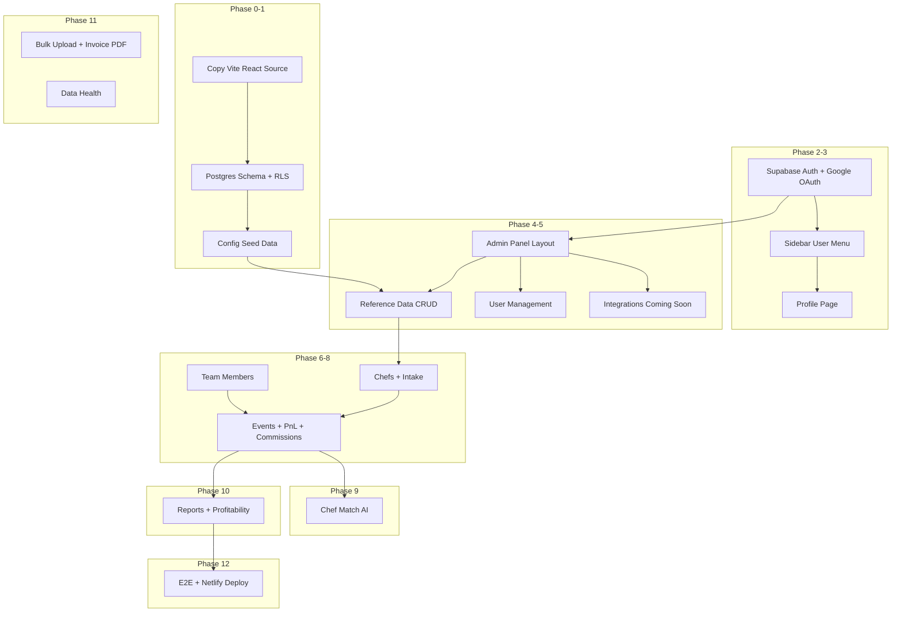

# Gradito Chef Intelligence — Phase-Wise Architectural Plan

Migration from [gradito-chef-flow](../gradito-chef-flow) (Vite + Base44) into Gradito-Intelligence.  
**Frontend stack unchanged. Backend replaced with Supabase. Frontend deployed to Netlify.**

---

## 1. Architecture Overview

```
┌─────────────────────────────────────────────────────────────┐
│  NETLIFY (Frontend)                                         │
│  Vite 6 + React 18 + React Router 6 + TanStack Query      │
│  Tailwind + shadcn/ui — design copied from source          │
└──────────────────────────┬──────────────────────────────────┘
                           │ @supabase/supabase-js
┌──────────────────────────▼──────────────────────────────────┐
│  SUPABASE (Backend) — enftlfmjakfcgaapzesx.supabase.co      │
│  ├── PostgreSQL + RLS                                       │
│  ├── Auth (email + Google OAuth)                            │
│  ├── Storage (chef photos)                                  │
│  └── Edge Functions (LLM, email, invites)                   │
└─────────────────────────────────────────────────────────────┘
```

### Stack Decisions

| Layer | Stack | Action |
|-------|-------|--------|
| **Frontend** | Vite 6 + React 18 + React Router 6 + TanStack Query + Tailwind + shadcn/ui | Keep — copy & reuse from gradito-chef-flow |
| **Design** | Navy/gold/ivory tokens, Playfair + Inter, 52 shadcn components | Copy as-is; modify only where Base44 calls are replaced |
| **Backend** | Supabase PostgreSQL + RLS + Edge Functions | Replace Base44 |
| **Email** | Resend SMTP via Supabase Edge Functions | New |
| **Deploy** | Netlify (SPA) + Supabase (DB, auth, functions) | Frontend → Netlify; backend → Supabase |

### What Changes vs What Stays

| Changes | Stays the Same |
|---------|----------------|
| `base44.entities.*` → Supabase repositories | React Router routes (13 pages) |
| `base44.auth.*` → `supabase.auth.*` | Vite build pipeline |
| `base44.integrations.*` → Edge Functions | Component hierarchy & UI |
| Hardcoded picklists → DB config tables | Tailwind/shadcn design system |
| User menu + Profile + Admin Panel (new) | Business logic (`pnlUtils`, `commissionUtils`) |
| Dashboard + dual-mode sidebar (ops / admin) | Navy/gold design tokens |
| Remove `/users` from main sidebar | Ops routes (Chefs, Events, Match, Reports) |

---

## 2. Project Structure (SOLID)

```
Gradito-Intelligence/
├── src/
│   ├── api/
│   │   └── supabaseClient.js          # replaces base44Client.js
│   ├── domain/                        # Pure business logic (no Supabase imports)
│   │   ├── pnl/                       # computePnL, calcExperienceFee
│   │   ├── commission/                # computeCommission
│   │   └── matching/                  # computeMatchScore
│   ├── infrastructure/
│   │   └── repositories/              # Data access only
│   │       ├── ChefRepository.js
│   │       ├── EventRepository.js
│   │       ├── ConfigRepository.js
│   │       └── ...
│   ├── hooks/
│   │   └── useAppData.js              # React Query hooks → repositories
│   ├── lib/                           # AuthContext, utils (adapt auth only)
│   ├── pages/                         # 13 routes — rewire data calls
│   ├── components/                    # Reuse all UI as-is
│   ├── App.jsx                        # React Router — enable ProtectedRoute
│   └── main.jsx
├── supabase/
│   ├── migrations/                    # Postgres schema + RLS
│   ├── functions/
│   │   ├── chef-match/                # LLM criteria + reasons
│   │   ├── parse-invoice-pdf/         # Invoice PDF extraction
│   │   ├── send-email/                # Resend SMTP
│   │   └── invite-user/               # User invitation
│   └── seed.sql
├── netlify.toml                       # SPA deploy config
├── vite.config.js                     # Remove @base44/vite-plugin
├── tailwind.config.js                 # Copy as-is
└── components.json                    # Copy as-is
```

### SOLID Principles

| Principle | Application |
|-----------|-------------|
| **S**ingle Responsibility | Repositories = DB queries; domain = pure math; pages = UI |
| **O**pen/Closed | Config picklists from DB; engines extensible without UI changes |
| **L**iskov | Repository functions return same shapes pages already expect |
| **I**nterface Segregation | Separate hooks: `useChefs`, `useEvents`, `useConfig` |
| **D**ependency Inversion | Pages → hooks → repositories; never `supabase.from()` in components |

---

## 3. Dependency Graph



**Start:** Phase 5 — User Management + Email.

> **Current status (Jul 2026):** Phases **0–4** and **sidebar UX polish** are **code-complete**. `npm run build` passes. Manual test gates in Sections 3B–3D still need sign-off in Supabase + browser before feature-module rewiring (Phase 6+).

---

## 3B. Phases 1–2 Scope & Manual Test Gates

Phases 3+ are documented below but **out of scope until Phases 1–2 pass all manual tests**.

### Phase 1 — Manual Test Checklist

Mark each item `[x]` when verified. Run tests in order.

#### 1.1 Deploy & schema

| # | Test | How to verify | Pass |
|---|------|---------------|------|
| P1-01 | `supabase link` connected | `supabase status` shows linked project `enftlfmjakfcgaapzesx` | [ ] |
| P1-02 | Migrations apply cleanly | `supabase db push` exits 0, no errors | [ ] |
| P1-03 | 23 tables exist | Supabase Dashboard → Table Editor: 10 config + 10 business + `profiles` + `app_roles` + `role_permissions` | [ ] |
| P1-04 | Seed applied | `supabase db seed` or seed in push; no duplicate-key errors | [ ] |

#### 1.2 Seed counts (SQL Editor)

Run in Supabase SQL Editor:

```sql
SELECT 'service_areas' AS t, count(*) FROM service_areas
UNION ALL SELECT 'holidays', count(*) FROM holidays
UNION ALL SELECT 'cuisines', count(*) FROM cuisines
UNION ALL SELECT 'experience_types', count(*) FROM experience_types
UNION ALL SELECT 'dietary_specialties', count(*) FROM dietary_specialties
UNION ALL SELECT 'languages', count(*) FROM languages
UNION ALL SELECT 'event_types', count(*) FROM event_types
UNION ALL SELECT 'package_types', count(*) FROM package_types
UNION ALL SELECT 'menu_tiers', count(*) FROM menu_tiers
UNION ALL SELECT 'lead_types', count(*) FROM lead_types
UNION ALL SELECT 'app_roles', count(*) FROM app_roles;
```

| # | Table | Expected count | Pass |
|---|-------|----------------|------|
| P1-05 | service_areas | 31 | [ ] |
| P1-06 | holidays | 14 | [ ] |
| P1-07 | cuisines | 12 | [ ] |
| P1-08 | experience_types | 11 | [ ] |
| P1-09 | dietary_specialties | 5 | [ ] |
| P1-10 | languages | 9 | [ ] |
| P1-11 | event_types | 3 | [ ] |
| P1-12 | package_types | 4 | [ ] |
| P1-13 | menu_tiers | 4 | [ ] |
| P1-14 | lead_types | 3 | [ ] |
| P1-15 | app_roles | 2 (`admin`, `user`) | [ ] |

#### 1.3 Critical seed strings

| # | Test | SQL | Pass |
|---|------|-----|------|
| P1-16 | Lead type exact match | `SELECT name FROM lead_types WHERE name = 'House Account / Referral'` → 1 row | [ ] |
| P1-17 | Punctuation preserved | `SELECT name FROM service_areas WHERE name LIKE '%Putnam%'` → `Westchester, Putnam & Fairfield` | [ ] |
| P1-18 | Commission rates | `SELECT closer_pct, facilitator_pct FROM lead_types WHERE name = 'Direct-Sourced'` → 10, 5 | [ ] |
| P1-19 | Menu tier price | `SELECT price_per_guest FROM menu_tiers WHERE name LIKE 'Classic%'` → 68 | [ ] |

#### 1.4 RLS (anon key — use browser console or curl with anon key)

| # | Test | Expected | Pass |
|---|------|----------|------|
| P1-20 | anon SELECT cuisines | 200, rows returned | [ ] |
| P1-21 | anon SELECT chefs | empty or 401/permission denied | [ ] |
| P1-22 | anon INSERT chef `profile_status='In Progress'` | succeeds | [ ] |
| P1-23 | anon INSERT chef `profile_status='Complete'` | denied | [ ] |

#### 1.5 Domain logic (local — no DB)

Run `node scripts/test-business-regression.mjs` or verify manually:

| # | Test | Expected | Pass |
|---|------|----------|------|
| P1-24 | `runWorkedExamples()` | all 9 commission assertions pass | [ ] |
| P1-25 | `calcExperienceFee('Signature Experience', 20)` | 2500 | [ ] |
| P1-26 | `calcFoodRevenue(..., 'Classic ($68)', 10)` | 680 | [ ] |
| P1-27 | `toAppRow({ created_at: '...' })` | includes `created_date` | [ ] |

#### 1.6 Repository smoke (authenticated — after Phase 2 user exists, or service role in script)

| # | Test | Expected | Pass |
|---|------|----------|------|
| P1-28 | `ChefRepository.list()` | returns array; each row has `created_date` | [ ] |
| P1-29 | Create + delete test event | cascades `event_chefs`, `commission_lines` | [ ] |
| P1-30 | `npm run build` | exits 0 | [ ] |

**Phase 1 complete when:** P1-01 through P1-30 all marked `[x]`.

---

### Phase 2 — Manual Test Checklist

**Prerequisite:** Phase 1 complete.

#### 2.1 Supabase Dashboard setup (one-time)

| # | Task | Pass |
|---|------|------|
| P2-01 | Auth → Providers → Email enabled | [ ] |
| P2-02 | Auth → Providers → Google enabled (Client ID + Secret) | [ ] |
| P2-03 | Auth → URL Configuration → Site URL = `http://localhost:5173` | [ ] |
| P2-04 | Redirect URLs include `http://localhost:5173/**` | [ ] |
| P2-05 | Google Console redirect URI = `https://enftlfmjakfcgaapzesx.supabase.co/auth/v1/callback` | [ ] |

#### 2.2 Email/password auth (browser)

| # | Test | Steps | Pass |
|---|------|-------|------|
| P2-06 | Register new user | `/register` → email + password → submit | [ ] |
| P2-07 | Email verification | Check inbox; confirm link works (if confirm enabled) | [ ] |
| P2-08 | Login | `/login` → credentials → lands on `/` | [ ] |
| P2-09 | Profile row created | SQL: `SELECT role, display_name FROM profiles WHERE id = auth.uid()` or dashboard | [ ] |
| P2-10 | Default role | New user `profiles.role` = `'user'` | [ ] |
| P2-11 | `last_login_at` set | After login, `profiles.last_login_at` is recent timestamp | [ ] |
| P2-12 | Logout | Log out → session cleared; `/` redirects to `/login` | [ ] |

#### 2.3 Protected routes

| # | Test | Steps | Pass |
|---|------|-------|------|
| P2-13 | Unauthenticated `/` | Open incognito → `/` → redirect to `/login` | [ ] |
| P2-14 | Unauthenticated `/events` | incognito → `/events` → redirect to `/login` | [ ] |
| P2-15 | Public `/intake` | incognito → `/intake` → form loads (no redirect) | [ ] |
| P2-16 | Public auth pages | incognito → `/login`, `/register`, `/forgot-password` load | [ ] |
| P2-17 | Authenticated access | Login → `/`, `/events`, `/team` all load | [ ] |

#### 2.4 Google OAuth

| # | Test | Steps | Pass |
|---|------|-------|------|
| P2-18 | Google sign-in | `/login` → "Continue with Google" → consent → lands on `/` | [ ] |
| P2-19 | Profile for Google user | `profiles` row exists with email from Google | [ ] |
| P2-20 | `last_login_at` on OAuth | timestamp updated after Google login | [ ] |

#### 2.5 Password reset

| # | Test | Steps | Pass |
|---|------|-------|------|
| P2-21 | Forgot password | `/forgot-password` → enter email → success message | [ ] |
| P2-22 | Reset link | Email link → `/reset-password` → set new password | [ ] |
| P2-23 | Login with new password | `/login` with new password works | [ ] |

#### 2.6 AuthContext integration

| # | Test | Expected | Pass |
|---|------|----------|------|
| P2-24 | No Base44 calls | Network tab: no requests to Base44 on load | [ ] |
| P2-25 | `useAuth().user` | has `email`, `role` from `profiles` | [ ] |
| P2-26 | Session persistence | Refresh page while logged in → still authenticated | [ ] |
| P2-27 | `npm run build` | exits 0 | [ ] |

**Phase 2 complete when:** P2-01 through P2-27 all marked `[x]`.

**Then proceed to Phase 3** (Sidebar User Menu + Profile). ✅ Code complete — see Section 3C.

---

## 3C. Phases 3–4 + Sidebar UX — Manual Test Gates

**Prerequisite:** Phases 1–2 manual tests passed (or run in parallel with Supabase setup).

### Phase 3 — User Menu + Profile

| # | Test | Pass |
|---|------|------|
| P3-01 | All users see Profile + Log Out in user menu | [ ] |
| P3-02 | Only `role = admin` sees Admin Panel in menu | [ ] |
| P3-03 | `/profile` — avatar upload works (`avatars` bucket migration applied) | [ ] |
| P3-04 | `/profile` — display name + change password work | [ ] |
| P3-05 | Last login time displays after login | [ ] |

### Phase 4 — Admin Panel + Reference Data CRUD

| # | Test | Pass |
|---|------|------|
| P4-01 | Non-admin cannot access `/admin/*` (redirects to `/dashboard`) | [ ] |
| P4-02 | Admin sees Integrations + User Management Coming Soon pages | [ ] |
| P4-03 | All 10 Reference Data CRUD pages work | [ ] |
| P4-04 | Deactivating config item hides from `useConfig()` results | [ ] |
| P4-05 | `/team`, `/data-health`, `/activity`, `/bulk-upload` redirect to `/admin/*` | [ ] |

### Sidebar redesign (v2) + polish

| # | Test | Pass |
|---|------|------|
| R1 | All users see Dashboard above Operations in ops sidebar | [ ] |
| R2 | Non-admin ops sidebar has NO Team / Data Health / Activity / Bulk Upload | [ ] |
| R3 | Non-admin visiting `/admin/team` → redirected away | [ ] |
| R4 | Admin clicks Admin Panel → sidebar switches to admin nav | [ ] |
| R5 | Admin sidebar shows Platform Ops + Integrations + User Mgmt + Reference Data | [ ] |
| R6 | "Back to dashboard" → `/dashboard` with ops sidebar restored | [ ] |
| R7 | No duplicate admin sub-nav in content area | [ ] |
| R8 | `/team` redirects to `/admin/team` for admin | [ ] |
| R9 | Reference Data CRUD + Platform Ops pages work | [ ] |
| S1 | Admin accordion sections collapse; active section auto-opens | [ ] |
| S2 | Sidebar collapse toggle → icon rail (`w-16`) on ops + admin | [ ] |
| S3 | Collapsed admin section icons open popover with child links | [ ] |
| S4 | Collapse preference survives refresh (`localStorage`) | [ ] |
| S5 | `npm run build` passes | [x] |

**Phases 3–4 + sidebar complete when:** P3-01 through P4-05 and R1–S4 marked `[x]`.

**Then proceed to Phase 5** (User Management + Resend email).

---

## 3A. Navigation & Admin Panel Design (current — post sidebar redesign)

Two sidebar modes share the same navy left panel; navigation switches on route.

### Mode A — Ops sidebar (`/dashboard`, `/`, `/events`, etc.) — all users

```
+------------------------------------------------------------------+
|  GRADITO                                    [collapse toggle]    |
|  Chef Intelligence                                                |
|                                                                   |
|  DASHBOARD                                                        |
|    Dashboard          -> /dashboard                               |
|                                                                   |
|  OPERATIONS                                                       |
|    Chefs | Events | Chef Match                                    |
|                                                                   |
|  ANALYTICS                                                        |
|    Reports | Profitability                                        |
|                                                                   |
|  (no Team / Data Health / Activity / Bulk Upload here)            |
|                                                                   |
|  [avatar]  User  v   -> Profile | Admin Panel* | Log Out          |
|                         *admin only                               |
+------------------------------------------------------------------+
```

### Mode B — Admin sidebar (`/admin/*`) — admin only

```
+------------------------------------------------------------------+
|  GRADITO                                    [collapse toggle]    |
|  Chef Intelligence                                                |
|                                                                   |
|  <- Back to dashboard          -> /dashboard                      |
|                                                                   |
|  ADMIN PANEL                                                      |
|  System configuration                                             |
|                                                                   |
|  > PLATFORM OPERATIONS     (accordion — click to expand)          |
|      Team | Data Health | Activity Log | Bulk Upload              |
|  > INTEGRATIONS            Integrations [Soon]                      |
|  > USER MANAGEMENT         Overview / Users / Roles / Perms [Soon]|
|  > REFERENCE DATA          10 config CRUD pages                     |
|                                                                   |
|  MAIN CONTENT (full width) — no inner left sub-nav                |
+------------------------------------------------------------------+
```

**Collapsed sidebar (both modes):** `w-16` icon rail; ops links show tooltips; admin sections show icon → popover submenu. Toggle persisted in `localStorage`. Shortcut: `Ctrl/Cmd+B`.

### `/profile` (all authenticated users)

```
+------------------------------------------------------------------+
|  Profile Picture [upload]                                         |
|  Email, Role, Last Login                                          |
|  [ Change Password ]                                              |
+------------------------------------------------------------------+
```

**Access rules:**
- `/dashboard` → any authenticated user
- Profile → any authenticated user
- Admin Panel (`/admin/*`) → `profiles.role = 'admin'` (Phase 5 adds `role_permissions` matrix)
- Platform Ops (Team, Data Health, Activity, Bulk Upload) → admin only, under `/admin/*`
- Log Out → any authenticated user

### Route map (current)

| Route | Page | Access |
|-------|------|--------|
| `/dashboard` | Dashboard (welcome + quick links) | authenticated |
| `/profile` | Profile | authenticated |
| `/admin` | Admin Panel index → reference data default | admin |
| `/admin/team` | Team | admin |
| `/admin/data-health` | Data Health | admin |
| `/admin/activity` | Activity Log | admin |
| `/admin/bulk-upload` | Bulk Upload | admin |
| `/admin/integrations` | Integrations (Coming Soon) | admin |
| `/admin/users` | User Management hub | admin |
| `/admin/users/list` | Users | admin (Phase 5) |
| `/admin/users/roles` | Roles CRUD | admin (Phase 5) |
| `/admin/users/permissions` | Role permissions matrix | admin (Phase 5) |
| `/admin/reference-data/*` | 10 config CRUD pages | admin |

**Legacy redirects:** `/team`, `/data-health`, `/activity`, `/bulk-upload`, `/users` → `/admin/*`

**Removed from ops sidebar:** Team, Data Health, Activity, Bulk Upload (admin panel only); `/users`, `/settings` (replaced by Admin Panel).

---

## 4. Phase-by-Phase Plan

### Phase 0 — Copy Source + Supabase Wiring ✅ COMPLETED

| | |
|---|---|
| **Status** | **Done** |
| **Depends on** | Nothing |

**Delivered:**
- Vite + React source copied to Gradito-Intelligence
- Base44 removed; `@supabase/supabase-js` wired
- `supabaseClient.js`, repository stubs, `netlify.toml`, `supabase/config.toml`
- Brand title updated (no Base44 in browser tab)
- `npm run dev` + `npm run build` verified

---

### Phase 1 — Database Schema, RLS, Seed Data ✅ CODE COMPLETE

> **Detailed plan:** [phase_1_database plan](/home/mazharul/.cursor/plans/phase_1_database_fcfba401.plan.md)

| | |
|---|---|
| **Status** | Migrations + repositories written; apply via `supabase db push` |
| **Depends on** | Phase 0 ✅ |
| **Blocks** | Phases 2–12 |

**Config tables (10):** `service_areas`, `holidays`, `cuisines`, `experience_types`, `dietary_specialties`, `languages`, `event_types`, `package_types`, `menu_tiers`, `lead_types`

**Core business tables (10):** `chefs`, `clients`, `events`, `event_chefs`, `event_vendors`, `team_members`, `commission_lines`, `match_runs`, `activity_logs`

**Identity tables (NEW for Profile + User Management):**
- `profiles` — `id`, `role`, `display_name`, `avatar_url`, `last_login_at`, timestamps
- `app_roles` — CRUD roles (seed: `admin`, `user` as system roles)
- `role_permissions` — `role_id`, `resource`, `action` (editable matrix in Phase 5)

**RLS + seed** from `constants.js`, `pnlUtils.js`, `commissionUtils.js`

**Test gate:** See **Section 3B** manual checklist P1-01 through P1-30.

---

### Phase 2 — Auth (Email + Google OAuth) ✅ CODE COMPLETE

| | |
|---|---|
| **Status** | AuthContext + auth pages + ProtectedRoute done; configure Supabase Dashboard (Email, Google OAuth, redirect URLs) |
| **Depends on** | Phase 1 |
| **Blocks** | Phases 3+ |

**Build:**
- `AuthContext.jsx` → `supabase.auth`
- `profiles` trigger on signup; track `last_login_at` on each login
- Enable `ProtectedRoute` in `App.jsx`
- Auth pages: Login, Register, ForgotPassword, ResetPassword
- Google OAuth via `signInWithOAuth({ provider: 'google' })`
- Public routes: `/login`, `/register`, `/forgot-password`, `/reset-password`, `/intake`

**Test gate:** See **Section 3B** manual checklist P2-01 through P2-27.

---

### Phase 3 — Sidebar User Menu + Profile Page ✅ CODE COMPLETE

| | |
|---|---|
| **Status** | `UserAccountMenu`, `Profile.jsx`, `AdminRoute` delivered |
| **Depends on** | Phase 2 |
| **Blocks** | Phase 4 (admin gate uses profile role) |

**Delivered:**

**Sidebar footer** — `UserAccountMenu`:
- **Profile** → `/profile`
- **Admin Panel** → `/admin` (visible only if `user.role === 'admin'`)
- **Log Out** → `supabase.auth.signOut()`

**Profile page** (`/profile`):
- Profile picture upload (Supabase Storage `avatars` bucket — migration `20260710120500_avatars_storage.sql`)
- Display: email, role, last login time
- Change password form (`supabase.auth.updateUser`)
- Update display name

**Files:** `UserAccountMenu.jsx`, `pages/Profile.jsx`, `AdminRoute.jsx`, `Sidebar.jsx`

**Test gate:** See **Section 3C** P3-01 through P3-05.

---

### Phase 4 — Admin Panel + Reference Data CRUD ✅ CODE COMPLETE

| | |
|---|---|
| **Status** | Admin routes, ConfigCrudTable, Coming Soon stubs delivered |
| **Depends on** | Phase 1, Phase 3 |
| **Blocks** | Phases 6–9 (config-driven picklists) |

**Delivered:**

**Admin Panel** (`/admin/*`):
- `AdminPanelLayout.jsx` — content-only `<Outlet />` (nav in main sidebar)
- `AdminRoute` — redirects non-admin to `/dashboard`
- Nested React Router routes under `/admin`

**Sections (admin sidebar):**

| Section | Route | Status |
|---------|-------|--------|
| Platform Operations | `/admin/team`, `/admin/data-health`, `/admin/activity`, `/admin/bulk-upload` | **Live** (admin only) |
| Integrations | `/admin/integrations` | **Coming Soon** |
| User Management | `/admin/users/*` | **Coming Soon** (Phase 5) |
| Reference Data | `/admin/reference-data/*` | **Live CRUD** — 10 config pages |

**Reference Data pages** (`ConfigCrudTable` + `useConfig(type)`):
- Service Areas, Holidays, Cuisines, Experience Types, Dietary Specialties, Languages, Event Types, Package Types, Menu Tiers, Lead Types

**Sidebar redesign (v2):** `Dashboard.jsx`, `OpsSidebarNav`, `AdminSidebarNav`, `adminNav.js` — dual-mode sidebar; Platform Ops moved off ops nav.

**Test gate:** See **Section 3C** P4-01 through P4-05 and R1–R9.

---

### Phase 4b — Sidebar UX Polish ✅ CODE COMPLETE

| | |
|---|---|
| **Status** | Accordion admin sections + collapse toggle delivered |
| **Depends on** | Phase 4 sidebar redesign |
| **Blocks** | nothing |

**Delivered:**
- `SidebarLayoutContext.jsx` — collapsed state, `localStorage`, `Ctrl/Cmd+B`
- `SidebarNavSection.jsx` — accordion (expanded) + popover submenu (collapsed)
- Collapsible sidebar: `w-60` expanded / `w-16` icon rail for ops + admin
- `AppLayout.jsx` — dynamic main margin

**Files:** `SidebarLayoutContext.jsx`, `SidebarNavSection.jsx`, updates to `Sidebar.jsx`, `AdminSidebarNav.jsx`, `OpsSidebarNav.jsx`, `UserAccountMenu.jsx`

**Test gate:** See **Section 3C** S1–S5.

---

### Phase 5 — User Management + Email (under Admin Panel) ⬅️ NEXT

| | |
|---|---|
| **Status** | Not started |
| **Depends on** | Phase 2, Phase 4 |
| **Blocks** | Fine-grained permissions (optional before Phase 6) |

**Build:**

**User Management** (replaces Coming Soon stubs):

| Sub-page | Route | Features |
|----------|-------|----------|
| Users | `/admin/users/list` | List users, invite, deactivate, assign role |
| Roles | `/admin/users/roles` | CRUD `app_roles` (system roles protected) |
| Permissions | `/admin/users/permissions` | Editable matrix: role × resource × action |

**Edge functions:**
- `send-email` (Resend) — invite, transactional
- `invite-user` — create auth user + send invite

**Integrations page:** update from Coming Soon → show Resend status when configured (SMTP settings read-only for now)

**Hooks:** `usePermission(resource, action)`, `useIsAdmin()`

**Test gate:**
- [ ] Admin invites user → email received
- [ ] Role CRUD works; system roles cannot be deleted
- [ ] Permission matrix changes enforce route access
- [ ] Forgot/reset password flow works

---

### Phase 6 — Chefs Module + Activity Log

| | |
|---|---|
| **Depends on** | Phase 4, Phase 2 |
| **Blocks** | Phases 7, 8, 11 |

**Build:** Rewire Chefs, ChefDetailPanel, ActivityLog to Supabase; `useConfig()` for picklists

**Test gate:** Chef CRUD + activity log + config-driven dropdowns

---

### Phase 7 — Public Chef Intake

| | |
|---|---|
| **Depends on** | Phase 6, Phase 4 |

**Build:** Rewire ChefIntake; Storage photo upload; holidays from config

**Test gate:** Public submit without auth

---

### Phase 8 — Team + Events Core

| | |
|---|---|
| **Depends on** | Phase 6, Phase 4, Phase 2 |
| **Blocks** | Phases 9, 10, 11 |

**Build:** Rewire Team, Events, CreateEventModal, EventDetailPanel

**Test gate:** Event create with chef assignments

---

### Phase 8b — P&L + Commissions

| | |
|---|---|
| **Depends on** | Phase 8 |

**Build:** Domain engines read `lead_types` + `menu_tiers` from DB; rewire EventPnL, EventAttribution, EventPayments

**Test gate:** Commission worked examples pass; finalize writes `commission_lines`

---

### Phase 9 — Chef Match AI

| | |
|---|---|
| **Depends on** | Phase 6, Phase 8, Phase 4 |

**Build:** Edge function `chef-match`; scoring engine; rewire ChefMatch page

**Test gate:** Full match flow end-to-end

---

### Phase 10 — Reports + Profitability

| | |
|---|---|
| **Depends on** | Phase 8b |

**Build:** Rewire Reports + Profitability dashboards

**Test gate:** Charts + XLSX export

---

### Phase 11 — Bulk Upload + Data Health + Invoice PDF

| | |
|---|---|
| **Depends on** | Phase 6, Phase 8b, Phase 4 |

**Build:** Rewire bulk import, data health, `parse-invoice-pdf` edge function

**Test gate:** Import dry run + commit

---

### Phase 12 — Polish, E2E, Netlify Deploy

| | |
|---|---|
| **Depends on** | All prior phases |

**Build:** E2E tests, production deploy, bug fixes

**Test gate:** Live site + E2E suite passes

---

### Phase 13 (Future) — Base44 Data Migration

- Export/import from Base44; not in initial scope

---

## 5. Implementation Summary

| Phase | Name | Status | Deliverable | Test Before Next |
|-------|------|--------|-------------|------------------|
| **0** | Copy + Wire | ✅ Done | Vite app, Base44 removed, Supabase client | `npm run dev` + `npm run build` |
| **1** | Database | ✅ Code | Migrations, RLS, seed, repositories | Section 3B P1-01–P1-30 |
| **2** | Auth | ✅ Code | Supabase auth + Google OAuth + `last_login_at` | Section 3B P2-01–P2-27 |
| **3** | User Menu + Profile | ✅ Code | `UserAccountMenu`, `/profile` | Section 3C P3-01–P3-05 |
| **4** | Admin Panel | ✅ Code | Reference Data CRUD, Coming Soon stubs, dual sidebar | Section 3C P4-01–P4-05, R1–R9 |
| **4b** | Sidebar UX | ✅ Code | Accordion sections + collapse toggle | Section 3C S1–S5 |
| **5** | User Management | ⬅️ Next | Users / Roles / Permissions + Resend email | Admin invite + matrix |
| **6** | Chefs | Pending | Chef module + activity log → Supabase | Chef CRUD |
| **7** | Intake | Pending | Public form + storage | Submit without auth |
| **8** | Team + Events | Pending | Events module → Supabase | Event + chef assignment |
| **8b** | P&L + Commissions | Pending | Financial engine | Commission finalize |
| **9** | Chef Match AI | Pending | Edge function + scoring | Match flow |
| **10** | Analytics | Pending | Reports + profitability → Supabase | Charts + export |
| **11** | Admin Ops | Pending | Bulk upload, data health, invoice → Supabase | Import flows |
| **12** | Deploy + E2E | Pending | Netlify production + tests | Live site works |
| **13** | Data migration | Future | Base44 → Supabase import | Record parity |

### What's next (recommended order)

1. **Sign off manual tests** — Sections 3B (Phases 1–2), 3C (Phases 3–4 + sidebar). Apply pending migrations if not done:
   - All files in `supabase/migrations/`
   - `20260710120500_avatars_storage.sql` (profile avatars)
   - Run seed; promote admin: `UPDATE profiles SET role = 'admin' WHERE ...`
2. **Phase 5 — User Management** — replace Coming Soon stubs with live pages:
   - `/admin/users/list` — list, invite, deactivate, assign role
   - `/admin/users/roles` — CRUD `app_roles`
   - `/admin/users/permissions` — role × resource matrix
   - Edge functions: `invite-user`, `send-email` (Resend)
   - Hooks: `usePermission()`, wire `AdminRoute` to permissions (optional)
3. **Phase 6 — Chefs** — first **data rewiring** phase: `useAppData.js` → repositories; config picklists from `useConfig()`. Unblocks Phases 7–11.
4. **Phases 7–8b** — Intake, Team, Events, P&L (core business workflows)
5. **Phases 9–11** — AI match, analytics, bulk ops (still on Base44 stubs until rewired)
6. **Phase 12** — E2E + Netlify deploy

> **Note:** Team, Data Health, Activity Log, and Bulk Upload **UI exists** but still reads Base44 stubs via `useAppData.js` until their respective rewiring phases (6 / 8 / 11).

---

## 6. Deployment Architecture

### Netlify (Frontend SPA)

```toml
# netlify.toml
[build]
  command = "npm run build"
  publish = "dist"

[[redirects]]
  from = "/*"
  to = "/index.html"
  status = 200
```

| Setting | Value |
|---------|-------|
| Build command | `npm run build` |
| Publish directory | `dist` |
| Node version | 18+ |
| SPA fallback | Required for React Router |

**Netlify env vars:**

| Variable | Value |
|----------|-------|
| `VITE_SUPABASE_URL` | `https://enftlfmjakfcgaapzesx.supabase.co` |
| `VITE_SUPABASE_ANON_KEY` | Supabase anon key |
| `VITE_APP_URL` | Netlify site URL |

### Supabase (Backend)

| Component | Deploy via |
|-----------|------------|
| Postgres + RLS | `supabase db push` |
| Auth (Site URL + redirects) | Supabase Dashboard |
| Edge Functions | `supabase functions deploy` |
| Storage bucket (`chef-photos`) | Supabase Dashboard |
| Resend API key | Supabase secrets |
| LLM API key | Supabase secrets |

---

## 7. Base44 → Supabase Replacement Map

| Base44 | Supabase |
|--------|----------|
| `base44.entities.Chef.list()` | `ChefRepository.list()` |
| `base44.entities.Chef.create(data)` | `ChefRepository.create(data)` |
| `base44.entities.Chef.update(id, data)` | `ChefRepository.update(id, data)` |
| `base44.auth.me()` | `supabase.auth.getUser()` + `profiles` |
| `base44.auth.loginViaEmailPassword()` | `supabase.auth.signInWithPassword()` |
| `base44.auth.loginWithProvider('google')` | `supabase.auth.signInWithOAuth()` |
| `base44.users.inviteUser(email, role)` | Edge function `invite-user` |
| `base44.integrations.Core.InvokeLLM()` | Edge function `chef-match` / `parse-invoice-pdf` |
| `base44.integrations.Core.UploadFile()` | `supabase.storage.upload()` |

---

## 8. Source Feature Inventory

### Operations Routes (ops sidebar)

| Route | Page | Key Actions |
|-------|------|---------------|
| `/dashboard` | Dashboard | Welcome + quick links; admin card → Admin Panel |
| `/` | Chefs | Add Chef, filters, detail panel, quick-edit |
| `/events` | Events | Create Event, filters, detail panel, status change |
| `/match` | Chef Match | Transcript → criteria → scored matches |

### Analytics Routes

| Route | Page | Key Actions |
|-------|------|---------------|
| `/reports` | Reports | By Area / Cuisine / Chef tabs |
| `/profitability` | Profitability | Period selector, 6 tabs, XLSX export |

### Admin Routes (admin sidebar — Platform Operations)

| Route | Page | Key Actions |
|-------|------|---------------|
| `/admin/team` | Team | CRUD team members, Closer/Facilitator roles |
| `/admin/data-health` | Data Health | Cleanup queues, bulk actions, export |
| `/admin/activity` | Activity Log | Filter by entity type |
| `/admin/bulk-upload` | Bulk Upload | Chefs XLSX, Events XLSX, Invoices PDF |

**Legacy redirects:** `/team`, `/data-health`, `/activity`, `/bulk-upload` → `/admin/*`

**Removed from ops sidebar:** Platform Ops pages (admin only); `/users` → Admin Panel; `/settings` → `/admin/reference-data/*`

### User Menu Routes (sidebar footer click)

| Route | Page | Access | Key Actions |
|-------|------|--------|---------------|
| `/profile` | Profile | authenticated | Avatar upload, email, role, last login, change password |
| `/admin` | Admin Panel | admin only | Hub for Integrations, User Management, Reference Data |
| — | Log Out | authenticated | `supabase.auth.signOut()` |

### Admin Panel Routes (`/admin/*` — admin only)

| Route | Page | Status | Key Actions |
|-------|------|--------|---------------|
| `/admin/integrations` | Integrations | Coming Soon | SMTP/Resend placeholder |
| `/admin/users` | User Management hub | Coming Soon | Links to sub-pages |
| `/admin/users/list` | Users | Phase 5 | Invite, deactivate, assign role |
| `/admin/users/roles` | Roles | Phase 5 | CRUD `app_roles` |
| `/admin/users/permissions` | Permissions | Phase 5 | Role × resource matrix |
| `/admin/reference-data/service-areas` | Service Areas | Live | Config CRUD |
| `/admin/reference-data/holidays` | Holidays | Live | Config CRUD |
| `/admin/reference-data/cuisines` | Cuisines | Live | Config CRUD |
| `/admin/reference-data/experience-types` | Experience Types | Live | Config CRUD |
| `/admin/reference-data/dietary-specialties` | Dietary Specialties | Live | Config CRUD |
| `/admin/reference-data/languages` | Languages | Live | Config CRUD |
| `/admin/reference-data/event-types` | Event Types | Live | Config CRUD |
| `/admin/reference-data/package-types` | Package Types | Live | Config CRUD |
| `/admin/reference-data/menu-tiers` | Menu Tiers | Live | Config CRUD |
| `/admin/reference-data/lead-types` | Lead Types | Live | Config CRUD |

### Public / Auth Routes

| Route | Page | Key Actions |
|-------|------|---------------|
| `/intake` | Chef Intake | Public form, photo upload, submit |
| `/login` | Login | Email/password + Google OAuth |
| `/register` | Register | Register + OTP verify |
| `/forgot-password` | Forgot Password | Send reset link |
| `/reset-password` | Reset Password | Set new password |

---

## 9. Design Reuse Strategy

**Copy directly (no changes):**
- `tailwind.config.js`, `src/index.css`, `components.json`
- All 52 `src/components/ui/` files
- Layout: `AppLayout`, `Sidebar`, `AuthLayout`
- Custom: `GoldStars`, `ChefAvatar`, `StatCard`

**Copy and modify (data calls only):**
- All `src/pages/*.jsx` (except Profile, Dashboard, admin — done for shell)
- Feature components (`chefs/`, `events/`, `match/`, etc.)
- `useAppData.js` → repositories (Phase 6+)

**Delivered (new layout + admin shell):**
- `src/components/layout/UserAccountMenu.jsx`, `OpsSidebarNav.jsx`, `AdminSidebarNav.jsx`
- `src/components/layout/SidebarLayoutContext.jsx`, `SidebarNavSection.jsx`
- `src/pages/Dashboard.jsx`, `src/pages/Profile.jsx`
- `src/pages/admin/` — Reference Data + Coming Soon pages
- `src/components/admin/AdminPanelLayout.jsx`, `ConfigCrudTable.jsx`
- `src/lib/adminNav.js`, `configMeta.js`, `useConfig.js`

**Remove:**
- `@base44/sdk`, `@base44/vite-plugin`, `base44/` folder, `base44Client.js`

**Add:**
- `@supabase/supabase-js`, `supabase/` folder, `netlify.toml`

---

## 10. Risk Notes

1. **Lead type mismatch:** Event schema uses `"House Account"` but UI uses `"House Account / Referral"` — normalize in seed.
2. **ProtectedRoute:** Enabled in `App.jsx` (Phase 2).
3. **Public intake RLS:** Anon insert only; no read access to other chefs.
4. **LLM provider:** Edge functions need OpenAI/Anthropic API key as Supabase secret.
5. **Google OAuth:** Configure redirect URI in Google Console + Supabase Auth → Netlify URL.
6. **SPA routing:** `/*` → `index.html` redirect mandatory on Netlify for React Router deep links.
